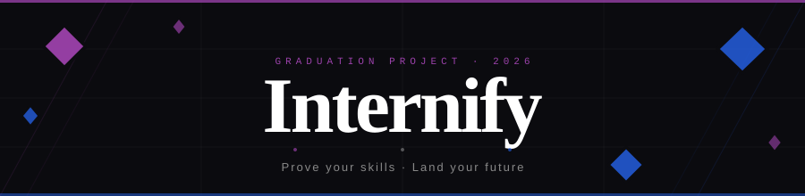

<div align="center">



**A two-sided learning-to-hiring platform, built as a graduation project.**

Connecting students with employers through real-world challenge tasks, giving students a way to prove their skills and giving employers a smarter way to discover talent beyond CV screening alone.

[](https://internify-one.vercel.app/)


</div>

---

## The Problem

> Entry-level hiring is broken on both sides.

- 🎓 Students graduate with theory but limited proof of real execution.
- 🏢 Employers spend time filtering candidates without enough evidence of practical ability.
- 🔁 The result: guesswork for companies and frustration for students.

**Internify closes that gap by making skill demonstration the center of the experience.**

Instead of relying on grades, resumes, or interviews alone:

- Employers post tasks based on real needs.
- Students explore, accept, and complete those tasks.
- Submissions become proof of ability and not just claims on paper.

---

## Features

<details>
<summary><strong>🌐 Public Platform</strong></summary>

- Landing page with role-based onboarding for students and employers
- About page explaining the motivation, problem, and vision
- Auth flow with multi-step signup, login, forgot-password, and profile completion
- Role-aware AI assistant, **Dalil**, available across the platform
- Public, shareable student profiles (`/students/[userId]`)
- Public certificate verification page (`/verify` and `/verify/[certificateId]`)

</details>

<details>
<summary><strong>🎓 Student Experience</strong></summary>

- Dashboard with overview, explore, messages, notifications, profile, and settings
- Explore tasks with real backend data, filtering, sorting, and task detail views
- **Intelligent task recommendations** ranked by skill-level fit, skill overlap, category affinity, and freshness
- Task acceptance flow with applicant limits
- Multi-format submissions (file upload, GitHub URL, or plain text)
- **AI evaluation results** with per-dimension scores, verdict, strengths, and improvement feedback
- **Skill XP system** — earn XP per skill on task completion, progressing through beginner → intermediate → advanced levels
- **Earned certificates** auto-generated on passing scores, with live reward toasts and a downloadable PDF
- Star ratings and written feedback from employers, surfaced on the profile
- Optional **AI-formatted task descriptions** for easier reading
- Profile with CV upload, AI CV generation, education, skills, and availability status

</details>

<details>
<summary><strong>🏢 Employer Experience</strong></summary>

- Dashboard with analytics, task management, messages, notifications, profile, and settings
- Task posting and editing with **AI skill suggestions** and an **AI-assisted rubric builder**
- Optional per-task AI-formatting and configurable XP-per-skill rewards
- Applicant tracking, submission visibility, and AI evaluation summaries
- Rate and leave feedback on completed submissions
- Talent search for browsing student profiles and skills
- Top-students showcase highlighting high performers
- Editable hiring-status badge (hiring / selective / not hiring)

</details>

<details>
<summary><strong>⚙️ Platform Systems</strong></summary>

- Clerk authentication integrated with Convex user persistence
- Real-time messaging and notifications with typing/online presence
- Role-aware navigation and dashboard routing
- File upload support for tasks, submissions, CVs, and logos
- Retrieval-assisted chatbot pipeline using Groq, Pinecone, and Hugging Face
- Multi-agent AI evaluation pipeline secured with a shared server secret
- Task contribution graph and gamified skill progression

</details>

---

## 🤖 AI Pipeline

The AI track that was previously planned is now **live**. Internify runs a multi-agent evaluation pipeline plus a suite of generative AI features powered by Groq.

| Feature                                  | Status        |
| ---------------------------------------- | ------------- |
| Automated submission grading             | ✅ Live        |
| Domain-specific evaluation agents        | ✅ Live        |
| Feedback generation for students         | ✅ Live        |
| Certificate generation & verification    | ✅ Live        |
| Skill XP & gamified progression          | ✅ Live        |
| Intelligent task recommendations         | ✅ Live        |
| AI CV generator & analyzer               | ✅ Live        |
| AI skill detection & rubric suggestion   | ✅ Live        |
| AI-formatted task descriptions           | ✅ Live        |
| Dalil retrieval-assisted assistant       | ✅ Live        |

**Evaluation agents.** Submissions are routed by task category to a specialized agent — `web`, `ai_ml`, `fullstack`, `se`, or `cybersec` — which scores the work across rubric dimensions and returns a verdict, strengths, improvements, and a summary. Passing evaluations (score ≥ 60) automatically mint a verifiable certificate and award skill XP.

---

## 🛠 Tech Stack

| Layer                  | Technology                                                                                          |
| ---------------------- | --------------------------------------------------------------------------------------------------- |
| **Frontend**           | Next.js 16, React 19, TypeScript                                                                   |
| **Styling / UI**       | Tailwind CSS v4, Radix UI, Lucide Icons, Devicon                                                    |
| **Animation**          | Motion, GSAP                                                                                        |
| **Auth**               | Clerk                                                                                               |
| **Backend / Database** | Convex                                                                                              |
| **AI / Retrieval**     | Groq (`openai/gpt-oss-120b`), Pinecone, Hugging Face (`sentence-transformers/all-MiniLM-L6-v2`) |
| **Documents**          | jsPDF, pdfjs-dist, JSZip (CV generation, PDF parsing, submission bundling)                          |
| **Validation / Forms** | Zod, React Hook Form                                                                                |

---

## 🎨 Design

Internify uses a custom **brutalist / neobrutalist** visual system built on top of Tailwind CSS, Radix UI primitives, and project-specific components.

Visual inspiration draws from **shadcn/ui** patterns for composable UI foundations and **[neobrutalism.dev](https://www.neobrutalism.dev/)** for bold, high-contrast styling direction.

> [!IMPORTANT]
> The project does **not** directly depend on neobrutalism.dev as a packaged UI framework. The current interface is a fully custom implementation tailored to Internify's brand, role colors, and interaction patterns.

---

## 📁 Project Structure

```text
internify/
├── src/
│   ├── app/
│   │   ├── (auth)/                     # Login, signup, forgot-password, complete-profile
│   │   │   ├── complete-profile/page.tsx
│   │   │   ├── forgot-password/page.tsx
│   │   │   ├── login/
│   │   │   │   ├── page.tsx
│   │   │   │   └── sso-callback/
│   │   │   ├── signup/page.tsx
│   │   │   └── layout.tsx
│   │   ├── about/page.tsx              # About / story page
│   │   ├── api/
│   │   │   ├── chat/route.ts           # Dalil chat assistant endpoint
│   │   │   ├── evaluate-submission/    # Multi-agent AI submission grading
│   │   │   ├── format-description/     # AI task-description formatting
│   │   │   ├── suggest-rubric/         # AI rubric suggestions for employers
│   │   │   ├── detect-skills/          # AI skill detection
│   │   │   ├── generate-cv/            # AI CV generation
│   │   │   ├── analyze-cv/             # AI CV analysis
│   │   │   ├── parse-cv-profile/       # CV → profile field parsing
│   │   │   ├── seed/route.ts           # Seed/testing helpers
│   │   │   └── seed-skill-xp/route.ts  # Skill-XP seeding helper
│   │   ├── dashboard/page.tsx          # Role-aware signed-in dashboard entry
│   │   ├── students/[userId]/page.tsx  # Public student profile page
│   │   ├── verify/                     # Certificate verification (list + by id)
│   │   ├── globals.css                 # Global styles
│   │   ├── layout.tsx                  # Root app layout
│   │   ├── not-found.tsx               # 404 page
│   │   └── page.tsx                    # Landing page
│   ├── components/
│   │   ├── about/                      # About page visuals
│   │   ├── auth/                       # Auth-specific presentation components
│   │   ├── employer/                   # Employer dashboard, task mgmt, analytics, rubric builder
│   │   │   └── talent-search/          # Employer talent search filters and results
│   │   ├── home/                       # Signed-in home controls
│   │   ├── landing/                    # Landing page sections and marketing UI
│   │   ├── providers/                  # App providers (Convex client, etc.)
│   │   ├── shared/                     # Messages, notifications, settings, ratings, certificates
│   │   ├── student/                    # Dashboard, explore, evaluation results, certificates, XP
│   │   ├── ui/                         # Reusable UI primitives and wrappers
│   │   ├── Chatbot.tsx                 # Role-aware Dalil assistant shell
│   │   ├── SignedInView.tsx            # Signed-in landing/home wrapper
│   │   ├── Stepper.tsx                 # Shared multi-step progress UI
│   │   └── ThemeToggle.tsx             # Theme switching control
│   └── lib/
│       ├── convexAuth.ts               # Auth helpers bridging Clerk and Convex
│       ├── cvPdfGenerator.ts           # CV → PDF rendering
│       ├── pdfTextExtractor.ts         # PDF text extraction for CV parsing
│       ├── egyptianData.ts             # Egyptian universities / cities data
│       ├── xp.ts                       # Skill-XP levels and thresholds
│       ├── skillCatalog.ts             # Skill definitions and metadata
│       ├── skillMatching.ts            # Skill matching utilities
│       └── utils.ts                    # Shared utility helpers
├── convex/
│   ├── _generated/                     # Convex generated API/types
│   ├── auth.config.ts                  # Convex auth integration config
│   ├── convex.config.ts                # Convex project config
│   ├── certificates.ts                 # Certificate generation & verification
│   ├── evaluations.ts                  # AI evaluation persistence and queries
│   ├── ratings.ts                      # Employer ratings of student submissions
│   ├── recommendations.ts              # Task recommendation engine
│   ├── recommendationHelpers.ts        # Recommendation scoring helpers
│   ├── seedSkillXp.ts                  # Skill-XP seeding logic
│   ├── messages.ts                     # Real-time messaging logic
│   ├── nameLimits.ts                   # Name validation rules
│   ├── notifications.ts                # Notification logic
│   ├── presence.ts                     # Typing / online presence handling
│   ├── schema.ts                       # Database schema
│   ├── tasks.ts                        # Task posting, acceptance, submissions, cleanup
│   └── users.ts                        # User creation / profile logic
├── public/                             # Static assets and branding files
├── testsprite_tests/                   # End-to-end / tooling test assets
├── next.config.ts                      # Next.js config
├── package.json                        # Scripts and dependencies
└── README.md                           # Project documentation
```

The product is organized around two main application surfaces — the **student side** (task discovery, acceptance, submission, communication, and profile building) and the **employer side** (task posting, talent search, candidate communication, and submission review) — both supported by shared infrastructure for auth, notifications, messaging, file handling, and AI.

---

## 👥 Team

### Tech Leads

| Name            | GitHub                                                 |
| --------------- | ------------------------------------------------------ |
| Abdallah Hamada | [@AbdullahHamadax](https://github.com/AbdullahHamadax) |
| Selim Waleed    | [@Sarremo2002](https://github.com/Sarremo2002)         |

### Full Team

1. Abdallah Mohamed Hamada
2. Selim Waleed Mohamed
3. Abdallah Ahmed Mousa
4. Ahmed Hisham Ahmed
5. Youssef Tarek Abdelmalak
6. Ahmed Nehad

---

## 📋 Contribution Highlights

<details>
<summary><strong>Abdallah Hamada</strong>: Platform foundation, frontend architecture, UI/UX polish</summary>

- Set up the initial project structure, global styles, landing page foundation, and early authentication architecture
- Integrated Clerk with Convex and built the multi-step signup, login, profile-completion, OAuth redirect, password-validation UX, and auth-guard improvements
- Led major frontend work for the employer-facing experience, including task management UI, analytics, employer profile/settings, task-detail polish, and talent-search frontend
- Shaped the platform's visual direction through typography migration, repeated UI redesigns, landing page refinement, about page redesign, LogoLoop improvements, and consistent brutalist-style polish
- Implemented and refined shared product systems such as notifications UX, typing and online indicators, message readability improvements, student settings/profile polish, accessibility cleanup, and responsiveness fixes
- Handled later structural fixes including landing/dashboard route separation, dashboard tab-routing cleanup, signed-in navigation fixes, chatbot presentation polish, and expired-task cleanup support

</details>

<details>
<summary><strong>Selim Waleed</strong>: Backend-connected product logic, role-based application flows</summary>

- Implemented auth and form-related fixes including unauthorized-access handling, password reset logic, input behavior fixes, captcha cleanup, and signup/login UX improvements
- Built the first real student dashboard flow, connecting explore tasks to backend data, improving filters, and replacing placeholder content with real task information
- Implemented core student workflow logic including task acceptance, applicant limits, and submission handling
- Implemented employer dashboard functionality for task creation, listing, and statistics
- Built talent-search functionality including student data retrieval and employer-facing search support
- Implemented real messaging logic for both employer and student experiences and polished message-related UI consistency
- Contributed to the AI-assistant effort through the dynamic role-aware Dalil integration

</details>

<details>
<summary><strong>Youseff Tarek</strong>: AI evaluation pipeline</summary>

- Built the multi-agent AI evaluation pipeline with domain-specific grading agents
- Submission analysis, intelligent scoring, and structured feedback generation
- Certificate generation and verification on passing evaluations

</details>

<details>
<summary><strong>Ahmed Hisham</strong>: AI experimentation & generative features</summary>

- AI experimentation and model/prompt workflow design
- Evaluation quality and rubric refinements
- AI CV generator and analyzer, plus assistant and grading support

</details>

<details>
<summary><strong>Abdallah Mousa</strong>: Updated Auth integration + AI infrastructure</summary>

- Contributed to updating Convex and Clerk's authentication and integration
- AI implementation and evaluation-pipeline integration support
- Infrastructure for the AI stage and the task recommendation system

</details>

<details>
<summary><strong>Ahmed Nehad</strong>: SRS documentation (in-progress), software testing (planned), and quality assurance (planned)</summary>

- Authored and maintained the Software Requirements Specification (SRS) document, defining functional and non-functional requirements for the Internify platform
- Documented use cases, system behavior, and acceptance criteria for both student and employer workflows
- Responsible for the platform's testing strategy, including test plan design, test case development, and defect tracking
- Conducting end-to-end and integration testing across authentication, task management, messaging, and submission flows
- Validating platform behavior against SRS requirements to ensure specification compliance
- Supporting quality assurance processes and contributing to pre-release verification efforts

</details>

---

## 🚀 Local Setup

### 1. Install dependencies

```bash
npm install
```

### 2. Configure environment variables

```bash
NEXT_PUBLIC_CONVEX_URL=
CLERK_JWT_ISSUER_DOMAIN=
CLERK_FRONTEND_API_URL=
GROQ_API_KEY=
PINECONE_API_KEY=
PINECONE_INDEX_NAME=
HF_TOKEN=
EVAL_SERVER_SECRET=        # Shared secret guarding the AI evaluation pipeline
```

You will also need the standard Clerk application keys for local development.

> [!IMPORTANT]
> `EVAL_SERVER_SECRET` must be set in **both** the Next.js environment and the Convex environment (`npx convex env set EVAL_SERVER_SECRET ...`). If the two values differ, the submission-evaluation pipeline will reject requests.

### 3. Run Convex

```bash
npx convex dev
```

### 4. Start the app

```bash
npm run dev
```

Then open [http://localhost:3000](http://localhost:3000).

---

## 📜 Scripts

```bash
npm run dev      # Start development server
npm run build    # Production build
npm run start    # Start production server
npm run lint     # Run linter
```

---

## 🔭 Vision

Internify is not just another internship portal. The long-term goal is a platform where:

- 🧑‍💻 Students prove skill through real work
- 🏢 Employers hire with stronger evidence
- 🤖 AI scales feedback, fairness, and evaluation

---

<div align="center">

Built by students, for students to prove skills through real work.

</div>
